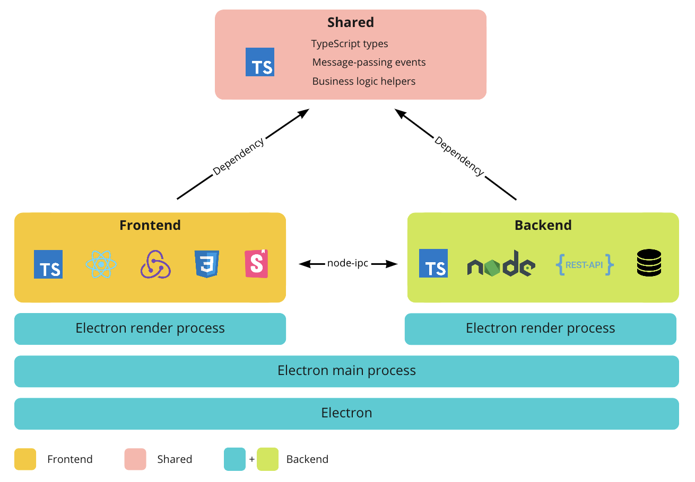

# 🧶 Advanced electron starter with yarn workspaces

Desktop apps are often a mix of UI and business logic.

In some cases, the business logic runs in a server and the desktop app may be a simple UI that interacts with said server executing CRUD operations.

In other cases, the app itself needs to contain the business logic and perform expensive computations (ex. machine learning, CPU intensive calculations).

[Electron.js](https://www.electronjs.org/) is a powerful framework that enables JS developers to create cross-platform desktop apps with the same technology stack used in the web. While the default process model of Electron scales well for UI heavy apps, there are limitations that may cause laggy UIs and poor developer experience.

This starter aims to bridge those limitations, focusing on performance and developer experience. It combines the latest web libraries with Electron.

This is exactly how my app [Taggr](https://taggr.ai/) is architected.

## High-level architecture

As mentioned above, this starter proposes an advanced architecture, best suited for complex Electron.js apps. Avoid over engineering your solution in the beginning, and consider the switch if you experience performance or developer experience limitations.

The architecture of this starter is divided into three modules: `frontend`, `electron-backend` and `shared`.

The code sharing between modules (the `shared` module) is managed with [yarn workspaces](https://classic.yarnpkg.com/en/docs/workspaces/).

### Frontend

**Stack**: [TypeScript](https://www.typescriptlang.org/) + [React (CRA)](https://github.com/facebook/create-react-app) + [Redux](https://redux-toolkit.js.org/) + [Storybook](https://storybook.js.org/)

The frontend module is responsible of all things UI, no business logic should live in this module.

During **development**, the frontend is served live from the webpack dev-server (from [http://localhost:3000](http://localhost:3000)).
In **production**, the frontend statics are [build](https://create-react-app.dev/docs/deployment/) and copied into the installable.

#### Main features

- Full TypeScript support.
- Develop components in isolation using Storybook.
- Store the fully-typed app state in Redux.
- Interact with the electron-backend through async message passing with `node-ipc`.
- Access to the `shared` module (through [yarn workspaces](https://classic.yarnpkg.com/en/docs/workspaces/)).
- Tests with [jest](https://jestjs.io/).

### Electron-backend

**Stack**: [TypeScript](https://www.typescriptlang.org/) + [Node.js](https://nodejs.org/en/)

The electron-backend module is responsible for the business logic, and the integrations with external dependencies such as databases and REST APIs.

It also contains the electron code required to build and package the app into a cross-platform executable.

In **development**, the backend code runs withing an Electron render process (browser window).
In **production**, the backend code runs as a separate node.js process (forked from the electron node.js process).

The architecture schema when in **development**:



#### Main features

- Full TypeScript support.
- Perform costly CPU and GPU operations without impacting the UI.
- Support for [native modules](https://www.electronjs.org/docs/tutorial/using-native-node-modules).
- Interact with the frontend through async message passing with `node-ipc`.
- Access to the `shared` module (through [yarn workspaces](https://classic.yarnpkg.com/en/docs/workspaces/)).
- Tests with [jest](https://jestjs.io/).

### Shared

**Stack**: [TypeScript](https://www.typescriptlang.org/)

There are great benefits to having a decoupled architecture. It is often easier to reason about and modify parts of it without impacting the other parts of the system, as long as the interaction contract between the modules it kept (API).

Since the `frontend` and `electron-backend` are separated modules, `shared` enables code sharing between them. This allows to define the frontend and electron-backend async event passing APIs in one place, and evolve the modules separatedly.

#### Main features

- Full TypeScript support
- Enable code sharing between `fronted` and `electron-backend` (through [yarn workspaces](https://classic.yarnpkg.com/en/docs/workspaces/)).

## Communication

The communication between the `frontend` and `electron-backend` modules is done by [node-ipc](https://github.com/RIAEvangelist/node-ipc), following the blueprint proposed in [this great post](https://archive.jlongster.com/secret-of-good-electron-apps).

It uses asynchronous message passing to transfer the events, and the communication layer is typed in the `shared` module. By doing so, both the `frontend` and `electron-backend` are decoupled, and the communication layer offers full type safety.

The `frontend` can trigger code in the `backend` by passing messages, and wait for an answer asynchronously. However, in some cases, the operations that `backend` should do may take significant time and resources.

Thats why the `frontend` also exposes event handlers, so that the `backend` can modify the state of the `frontend` (redux store) when needed.

## Getting up and running

```bash
# install dependencies
yarn

# watch changes in the modules
yarn modules:watch

# start the app in development mode
yarn watch

```

## Building app for production

```bash
yarn build
# executable in: `./electron-backend/dist`
```
